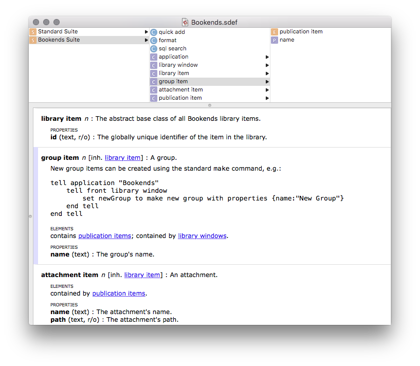

# Scripting Bookends 13 with AppleScript – A Getting Started Guide

## About AppleScript

[AppleScript](http://en.wikipedia.org/wiki/AppleScript) is an object-oriented scripting language with an English-like language syntax. It can be used on macOS to automate repetitive tasks, combine features from multiple scriptable applications, and to create complex workflows.


## AppleScript language essentials

### Getting data

In order to get data from Bookends, you need to specify Bookends as the target of your AppleScript commands with a so called "tell statement". I.e., all your Bookends-related commands are wrapped within a `tell application "Bookends"` block:

```applescript
tell application "Bookends"
	get library windows
end tell
```

A tell statement specifies a default target for all commands contained within it. If you have only one command, you can also include the tell statement on the same line:

```applescript
tell application "Bookends" to get library windows
```

In the above examples, we use the `get` command to fetch a list of all library windows that are currently open in Bookends. The `get` command has itself a target (in this case, `library windows`) which is the object that responds to the command. The command's target appears immediately next to the command and is also called the "direct parameter" of the command.


### Lists

In AppleScript, a list is an ordered collection of values of any class. Lists are indicated with braces, and values in a list are separated by commas. As an example, the following command assigns a list with 4 items – two integer numbers, some text and a decimal ("real") number – to a variable named "myList":

```applescript
set myList to {1, 3, "Sonny Software", 5.5}
```

The elements ([see below](#elements)) of lists are referred to as "items". You can refer to any list item by its item number. For example, for the above list, the following commands would all return the integer `3`:

```applescript
get item 2 of myList
get 2nd item of myList
get second item of myList
```

Here's some other examples how list items can be accessed:

```applescript
get last item of myList
get items 2 thru 3 of myList
```

You can also use `front` or `back` to refer to the first or last element, respectively. This is often used when referring to application windows:

```applescript
tell application "Bookends"
	get properties of front library window
end tell
```


### Properties

A property of an object is a characteristic that has a single value and a label, such as the `name` property of a library window:

```applescript
tell application "Bookends"
	get name of front library window
end tell
```

Property values can be read/write or read only. The image below lists all properties (and example values) of the Bookends library window (an icon next to each property indicates a read-only property):


A property may also represent another related object (which itself has properties). For example, this will return the "Recently Viewed" group which is one of the scriptable objects of the Bookends library window:

```applescript
tell application "Bookends"
	get group recently viewed of front library window
end tell
```

Using the `of` keyword you can get to any sub-properties:

```applescript
tell application "Bookends"
	get publication items of group recently viewed of front library window
end tell
```

Since the "Recently Viewed" group is [contained](#container-hierarchy) in the Bookends library window, the window can also be specified as the group's target (via a tell statement):

```applescript
tell application "Bookends"
	tell front library window
		get publication items of group recently viewed
	end tell
end tell
```

Instead of getting properties one by one, you can get all properties of an object at once:

```applescript
tell application "Bookends"
	tell front library window
		get properties of first item of publication items of group recently viewed
	end tell
end tell
```

The result is a "record". Here's part of the record resulting from the above command:


### Records

A record is an unordered collection of labeled properties (key-value pairs). A record appears in a script as a series of property definitions contained within braces and separated by commas. Each property definition consists of a unique label, a colon, and a value for the property. For example, the following is a record with three properties:

```applescript
{title:"My great new paper", publication date string:"2019/01/31", rating:5}
```


### Elements

An element is an object contained within another object. An object can contain many elements or none, and the number of elements that it contains may change over time. As an example, a Bookends library window has related objects such as your groups and publications. A publication, in turn, has attachments. These are defined as elements. Here's an example that shows the elements defined for a library window:


Similar to properties, you can access these elements using the `of` keyword:

```applescript
tell application "Bookends"
	tell front library window
		get attachment items of last item of publication items
	end tell
end tell
```

Alternatively, this more compact variant will also work:

```applescript
tell application "Bookends"
	tell front library window
		get attachment items of last publication item
	end tell
end tell
```

Elements will be returned as a [list](#lists) of objects.


### Filtering

A filter specifies all objects in a container (such as a collection of elements) that match a condition, or test, specified by a Boolean expression. In effect, a filter reduces the number of objects in a container.

As an example, instead of specifying every publication in your Bookends library, the following returns just those publications that have the word "review" in their title:

```applescript
tell application "Bookends"
	tell front library window
		get every publication item whose title contains "review"
	end tell
end tell
```

A term that uses the filter form is also known as a `whose` clause. You can use the words `where` or `that` as synonyms for `whose`. Note that the filter form works with application objects only. I.e., it cannot be used to filter the AppleScript objects `list`, `record`, or `text`.

The return value of a filter reference form is a list of the objects that pass the test. If no objects pass the test, the list is an empty list: `{}`. You can also combine multiple tests within a single `whose` clause:

```applescript
tell application "Bookends"
	tell front library window
		get every publication item whose title contains "review" and authors contains "Thomas, D"
	end tell
end tell
```

A filter reference form could be rewritten in form of a `repeat` statement. For example, this is equivalent to the above:

```applescript
tell application "Bookends"
	tell front library window
		set pubList to every publication item
		set myList to {}
		repeat with i from 1 to count of pubList
			set aPub to item i of pubList
			if title of aPub contains "review" and authors of aPub contains "Thomas, D" then
				copy aPub to end of myList
			end if
		end repeat
		get myList
	end tell
end tell
```

While a `whose` clause is often the fastest way to obtain the desired information, more complex filtering may only be possible with a `repeat` statement.


## Scripting Bookends

Bookends 13.2 and above features extensive AppleScript support that allows to easily fetch data from a Bookends library and to execute commands (such as import by identifier, or formatting of references). The scripting support in Bookends also enables you to create new references and to set its properties.


### Object inheritance

The Bookends scripting interface exposes object classes for the most important elements of your Bookends library in a hierarchical data model:


All publication-related object classes descend from an abstract base class (`library item`) which contains properties that are shared among all subclasses (like the object's ID). I.e., if you get all properties of a concrete object, e.g.:

```applescript
tell application "Bookends"
	tell front library window
		get properties of first attachment item of first publication item
	end tell
end tell
```

the superclass's properties (such as the ID) will be returned as well:


Note that Bookends enforces unique names for any of your groups and attachments. Thus, group and attachment names can be also used as their IDs.


### AppleScript dictionary

A dictionary is the part of a scriptable application that specifies the scripting terms it understands. The dictionary documents all object classes with its properties and elements, and may contain useful hints or sample code. You can choose "File > Open Dictionary" in Script Editor to display the dictionary of a scriptable application such as Bookends:



Here's the same dictionary in [Script Debugger](#tools), a third-party AppleScript debugger (which also offers a free "lite" version):


### Container hierarchy

A container is an object that contains one or more objects or properties. The application target (identified by the `tell application "Bookends"` statement) constitutes the top-level container. The subordinate library window target contains elements for the main object classes:


This allows you to easily get all objects of a certain class. For instance, this would return all of the groups that you've added to your Bookends library:

```applescript
tell application "Bookends"
	tell front library window
		get group items
	end tell
end tell
```

This is the same as above:

```applescript
tell application "Bookends" to get every group item of front library window
```

Using the `of` keyword you can walk along the container hierarchy and follow the defined object relationships. For instance, this would return a list of publications by group, and assign the returned list to a variable:

```applescript
tell application "Bookends"
	tell front library window
		set pubList to publication items of every group item
	end tell
end tell
```

The result of the above command is a list of lists where the root items represent group items and the sub-items consist of the publication items in each group:


Similarly, for each publication in a group, this would return a list of all attachments of that publication:

```applescript
tell application "Bookends"
	tell front library window
		get attachment items of publication items of every group item
	end tell
end tell
```

Use the following notation to simultaneously extract an equally sorted list of group names, and assign the lists to variables:

```applescript
tell application "Bookends"
	tell front library window
		set {pubsByGroup, groupNames} to {publication item, name} of every group item
	end tell
end tell
```

You can then walk these lists using a `repeat` statement.


### Creating new objects

The easiest way of importing new publications is via the `quick add` command which will automatically fetch publication metadata for some given identifier(s) (see [Importing publications](#importing-publications) below).

If you want to manually create a new publication, you can use the standard `make` command, e.g.:

```applescript
tell application "Bookends"
	tell front library window
		make new publication item with properties {title:"My great new paper", publication date string:"2019/01/31"}
	end tell
end tell
```

Here's a more detailed example for a real-world journal article:

```applescript
tell application "Bookends"
	tell front library window
		make new publication item with properties {authors:"Mock, T" & linefeed & "Thomas, DN", citekey:"Mock+Thomas2005", doi:"10.1111/j.1462-2920.2005.00781.x", pmid:"15819843", title:"Recent advances in sea-ice microbiology", publication date string:"2005/03/21", journal:"Environ Microbiol", volume:"7(5)", pages:"605-619"}
	end tell
end tell
```

Note that for string-based multi-value fields (like the `authors`, `editors`, `keywords` or `attachments` properties of the `publication item` class), individual values must be separated by a newline character. I.e., either use `\n`:

```applescript
"Mock, T\nThomas, DN"
```

or, alternatively, use AppleScript's `linefeed` keyword:

```applescript
"Mock, T" & linefeed & "Thomas, DN"
```


Similar to creating publications, you can use the `make` command to create a new static group:

```applescript
tell application "Bookends"
	tell front library window
		make new group item with properties {name:"New Group"}
	end tell
end tell
```

For more info on groups, see [Working with groups](#working-with-groups) below.


### Updating object properties

You can set new values for any writable object property. For instance, this would update the title of the most recently added publication in your frontmost Bookends library:

```applescript
tell application "Bookends"
	tell front library window
		set aPub to last publication item
		set title of aPub to "My great new paper"
	end tell
end tell
```

You can also edit multiple objects at once. In most cases, you'll need to specify a `whose` clause to only update objects that match a certain condition. For instance, this command batch-updates the rating of all publications whose keywords field contains the string "review":

```applescript
tell application "Bookends"
	tell front library window
		set rating of (every publication item whose keywords contains "review") to 4
	end tell
end tell
```

Of course, you could also use a `repeat` statement instead:

```applescript
tell application "Bookends"
	tell front library window
		set pubList to every publication item whose keywords contains "review"
		repeat with aPub in pubList
			set rating of aPub to 4
		end repeat
	end tell
end tell
```

Please be aware that the update of objects is performed instantly and that this action cannot be undone.


### Deleting objects

This will delete the most recently added publication from your frontmost Bookends library:

```applescript
tell application "Bookends"
	delete last publication item of front library window
end tell
```

As usual, you can also use a `whose` clause to specify the list of publications that a command will act on. For instance, in the below example, the checks for `title` and `keywords` ensure that only those publications get deleted which have the title "My great new paper" and which have no keywords assigned:

```applescript
tell application "Bookends"
	tell front library window
		delete (every publication item whose title is "My great new paper" and keywords is "")
	end tell
end tell
```

Please be aware that the deletion of objects is performed instantly and that this action cannot be undone.


## Use cases

### Importing publications

Besides [creating new publications](#creating-new-objects) manually, the Bookends scripting interface features a `quick add` command which allows you to add publications via their identifier. Bookends will automatically fetch publication metadata for the given identifier(s) and, if successful, create new publication(s) with these metadata.

This will import three publications (via their DOI, PMID and arXiv ID, respectively) into the front library window:

```applescript
tell application "Bookends"
    set pubList to quick add {"10.1084/jem.20052494", "20465544", "arXiv:0706.0001"}
end tell
```

You can pass any combination of the following identifiers to the `quick add` command: DOI, PMID, ISBN, JSTOR URL, or arXiv ID. Note that you must always pass a list, even if you specify only a single identifier. Also, you can target a specific library window explicitly:

```applescript
tell application "Bookends"
	set pubList to quick add {"9781405185806"} to second library window
end tell
```


### Working with groups

Bookends offers scripting access to its built-in groups via dedicated `library window` properties:

```applescript
tell application "Bookends"
	tell front library window
		set allGroup to group all
		set attGroup to group attachments
		set hitsGroup to group hits
		set recentsGroup to group recently viewed
	end tell
end tell
```

As mentioned [above](#properties), you can easily get all publications of a group, in this case all publications with attachments:

```applescript
tell application "Bookends"
	tell front library window
		set pubsWithFiles to publication items of group attachments
	end tell
end tell
```

As always, you can apply a [filter](#filtering) in order to fetch only a subset of the group's publications. For example, this will only return publications with multiple attachments:

```applescript
tell application "Bookends"
	tell front library window
		set pubsWithMultipleFiles to publication items of group attachments whose attachments contains "\n"
	end tell
end tell
```

Your own groups are available via the `group item` element of the `library window` class:

```applescript
tell application "Bookends"
	set myGroups to group items of front library window
end tell
```

We've already seen how the `make` command can be used to create new groups (see [creating new objects](#creating-new-objects) above). Here's how to create a new group with all publications that were added to your frontmost library within the last 2 days:

```applescript
tell application "Bookends"
	tell front library window
		set timeDiff to (current date) - 2 * days -- last 2 days
		set recentlyAddedPubs to publication items where date added > timeDiff
		if recentlyAddedPubs is not {} then
			set groupName to "New Group"
			make new group item with properties {name:groupName}
			add recentlyAddedPubs to group item groupName
		end if
	end tell
end tell
```

In the above example, we use the `add` command to add publications to the newly created group. Similarly, you can use the `remove` command to remove some publication(s) from a group. In the example below, we remove the most recently added publication from a group named "New Group":

```applescript
tell application "Bookends"
	tell front library window
		set groupName to "New Group"
		set lastAddedPub to last publication item
		set idList to id of publication items of group item groupName
		if id of lastAddedPub is in idList then
			remove lastAddedPub from group item groupName
		end if
	end tell
end tell
```

Note that the `remove` command will only remove the given publication(s) from the specified group, but the publication(s) will still remain in your library.


### Finding publications

By now, you've already seen many examples of how to use a [filter](#filtering) to find all publications matching a condition or test.

In addition to using a `whose` clause, Bookends also offers an `sql search` command which allows you to search for publications using an SQL query. For the below example, Bookends will return all publications whose keywords field contains either the string "primary production" or "primary productivity":

```applescript
tell application "Bookends"
	tell front library window
		set matchingPubs to sql search "keywords REGEX '(?i)primary producti(on|vity)'"
	end tell
end tell
```

In the above Regex query, the `(?i)` notation causes the search to be performed case insensitive. The `(…|…)` construct describes an alternation which, within the parens, matches either the expression to the left of the vertical line (`|`), or the right one. For more info on SQL/Regex searches, please see the Bookends user guide as well as [Regular Expression Metacharacters](http://userguide.icu-project.org/strings/regexp#TOC-Regular-Expression-Metacharacters).

Here's another example which will return all publications whose authors field contains the lastname "Nicol":

```applescript
tell application "Bookends"
	tell front library window
		set matchingPubs to sql search "authors REGEX '\\bNicol\\b,'"
	end tell
end tell
```

Note that the name "Nicol" is wrapped within expressions that match a word boundary (`\b`). This ensures that the query matches only entire words and not occurrences in other words (such as "Nicols" or "Nicolson"). Also note that, in AppleScript scripts, any Regex expressions which use a backslash (`\`) must be escaped (`\\`). I.e., instead of `\b` you must write `\\b` in the script.


### Formatting publications

The Bookends scripting interface allows you to output publications as formatted references. The example below will format the most recently added publication as a formatted reference, and copy it to the system clipboard—ready for insertion into another app:

```applescript
tell application "Bookends"
	tell front library window
		set formattedReference to format last publication item
		set the clipboard to formattedReference
	end tell
end tell
```

By default, the used format will correspond to the default format that you've specified in Bookends (see the "Biblio > Default Format" menu).

You can also specify the desired output format explicitly, and you can format a list of publications at once:

```applescript
tell application "Bookends"
	tell front library window
		set pubsList to every publication item whose keywords contains "thesis"
		if pubsList is not {} then
			set formattedReferences to format pubsList using "Vancouver.fmt"
		end if
	end tell
end tell
```

The `format` command's `using` parameter accepts any format name supported by the Bookends formats manager (see the "Biblio > Formats Manager…" menu).


### Exporting publications

You can also use the `format` command to output publications in bibliographic exchange formats (such as BibTeX, EndNote XML or RIS). This example will copy all publications of your "Hits" group as BibTeX to the system clipboard:

```applescript
tell application "Bookends"
	tell front library window
		set pubsList to publication items of group hits
		if pubsList is not {} then
			set bibtexContent to format pubsList using "BibTeX.fmt" as BibTeX
			set the clipboard to bibtexContent
		end if
	end tell
end tell
```

Here's a more advanced example which will export all publications contained in a group named "My Papers" as RIS to a file (named "Bibliography.ris") on your desktop:

```applescript
tell application "Bookends"
	set groupName to "My Papers" -- adopt to your needs
	set outFile to ((path to desktop from user domain) as string) & "Bibliography.ris"
	tell front library window
		set pubsList to publication items of group item groupName
		if pubsList is not {} then
			set risContent to format pubsList using "RIS.fmt"
			my writeTextToFile(outFile, risContent)
		end if
	end tell
end tell

--- Saves the given text to the specified file. Note that this will replace any existing file content.
on writeTextToFile(aFile, theText)
	set aFileRef to open for access aFile with write permission
	set eof aFileRef to 0
	write theText to aFileRef as «class utf8»
	close access aFileRef
end writeTextToFile
```

The above example uses a dedicated handler (`writeTextToFile()`) to write the generated RIS content to a text file. For more info on script handlers, see Apple`s [Mac Automation Scripting Guide
](https://developer.apple.com/library/archive/documentation/LanguagesUtilities/Conceptual/MacAutomationScriptingGuide/UseHandlersFunctions.html).


## Resources

* [AppleScript Language Guide](https://developer.apple.com/library/mac/documentation/AppleScript/Conceptual/AppleScriptLangGuide/introduction/ASLR_intro.html)

	Apple's guide to the AppleScript language gives a good overview of the language and describes its lexical conventions, syntax, keywords, and other elements in detail.

* [AppleScript @ Wikipedia](http://en.wikipedia.org/wiki/AppleScript)

	The Wikipedia page for AppleScript features also a good summary of the language essentials such as data types, conditionals, loops, handlers, etc.

* [Mac OS X Automation](http://macosxautomation.com/applescript/)

	A website with useful AppleScript resources ranging from tutorials (such as a [step-by-step AppleScript tutorial](http://macosxautomation.com/applescript/firsttutorial/index.html)), [script examples](http://macosxautomation.com/applescript/learn.html) and links to further [online resources about AppleScript](http://macosxautomation.com/applescript/resources.html).

* [AppleScript for Absolute Starters](http://fischer-bayern.de/as/as4as/AS4AS_e.pdf)

	A free eBook by Bert Altenburg published in 2003 that is still a useful introduction to AppleScript.

* [Some AppleScript tips](http://nathangrigg.net/2012/06/some-applescript-tips/)

	A good compilation of AppleScript tips by Nathan Grigg that explain, for instance, how to specify files in AppleScript, how to run an AppleScript from the command line, or how to pass variables by reference.

* Since OS X 10.6, AppleScript allows to call Cocoa methods from within AppleScript scripts. The aforementioned [Mac OS X Automation](http://macosxautomation.com/applescript/) web site has a good compilation of [resources and tools for AppleScriptObjC](http://macosxautomation.com/applescript/apps/index.html).


## Tools

* [Script Debugger](http://www.latenightsw.com) is a powerful third-party AppleScript debugger (which also offers a free "lite" version). Besides full debugging capabilities, Script Debugger features advanced dictionary viewers. It also offers unique value explorers that allow you to dynamically inspect the objects and properties offered by a scriptable application. Examples of its dictionary viewers and value explorers can be seen in some of the screenshots above.

