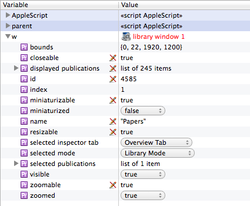
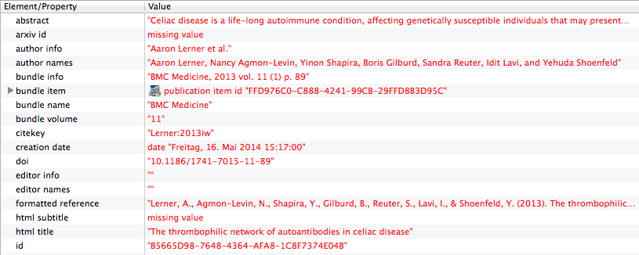
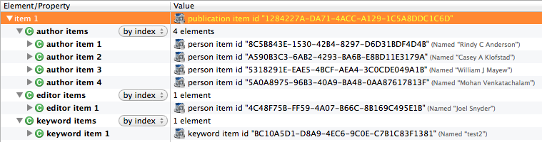
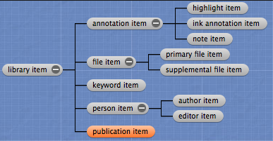
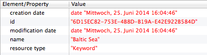
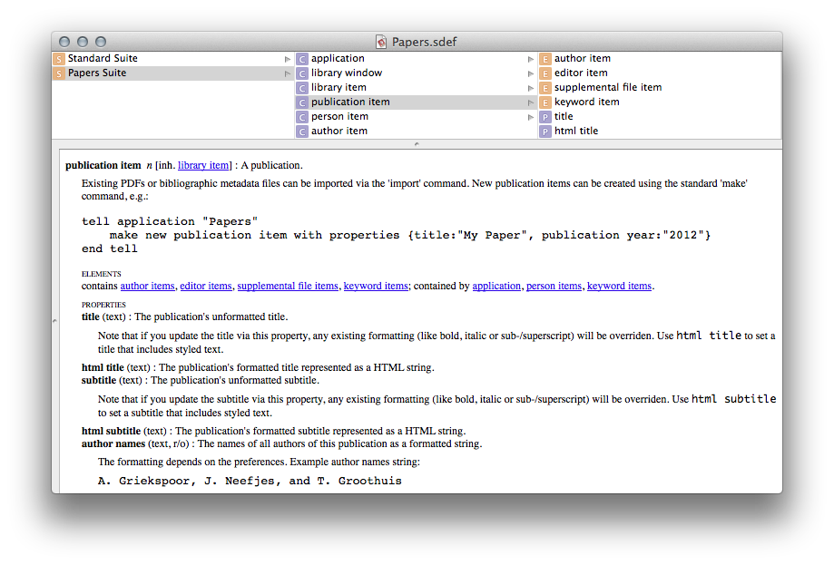
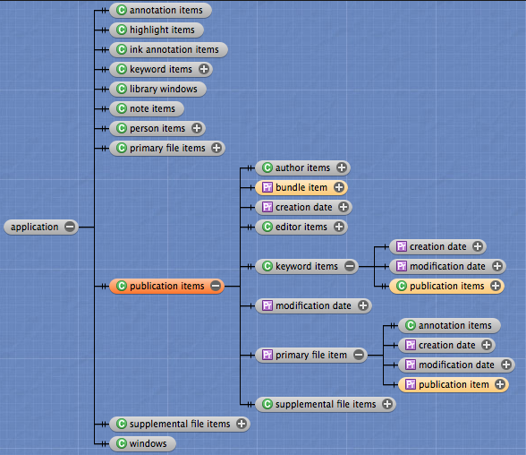
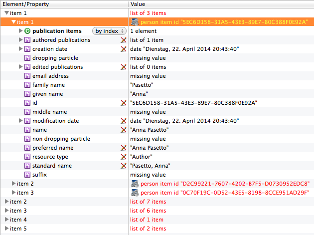

# Scripting Papers 3 for Mac with AppleScript – A Getting Started Guide

## About AppleScript

[AppleScript](http://en.wikipedia.org/wiki/AppleScript) is an object-oriented scripting language with an English-like language syntax. It can be used on OS X to automate repetitive tasks, combine features from multiple scriptable applications, and to create complex workflows.


## AppleScript language essentials

### Getting data

In order to get data from Papers, you need to specify Papers as the target of your AppleScript commands with a so called "tell statement". I.e., all your Papers-related commands are wrapped within a `tell application "Papers"` block:

```applescript
tell application "Papers"
	get publication items
end tell
```

A tell statement specifies a default target for all commands contained within it. If you have only one command, you can also include the tell statement on the same line:

```applescript
tell application "Papers" to get publication items
```

In the above examples, we use the `get` command to fetch a list of all publications in the current library. The `get` command has itself a target (in this case, `publication items`) which is the object that responds to the command. The command's target appears immediately next to the command and is also called the "direct parameter" of the command.


### Lists

In AppleScript, a list is an ordered collection of values of any class. Lists are indicated with braces, and values in a list are separated by commas. As an example, the following command assigns a list with 4 items – two integer numbers, some text and a decimal ("real") number – to a variable named "myList":

```applescript
set myList to {1, 7, "Beethoven", 4.5}
```

The elements ([see below](#elements)) of lists are referred to as "items". You can refer to any list item by its item number. For example, for the above list, the following commands would all return the integer `7`:

```applescript
get item 2 of myList
get 2nd item of myList
get second item of myList
```

Here's some other examples how list items can be accessed:

```applescript
get last item of myList
get items 2 thru 3 of myList
```

You can also use `front` or `back` to refer to the first or last element, respectively. This is often used when referring to application windows:

```applescript
tell application "Papers"
	get properties of front library window
end tell
```


### Properties

A property of an object is a characteristic that has a single value and a label, such as the `title` property of a publication:

```applescript
tell application "Papers"
	get title of first item of publication items
end tell
```

Property values can be read/write or read only. The picture below lists all properties (and example values) of the Papers library window (an icon next to each property indicates a read-only property):



You can get all properties of an object at once:

```applescript
tell application "Papers"
	get properties of first item of publication items
end tell
```

The result is a "record". Here's part of the record resulting from the above command:




### Records

A record is an unordered collection of labeled properties (key-value pairs). A record appears in a script as a series of property definitions contained within braces and separated by commas. Each property definition consists of a unique label, a colon, and a value for the property. For example, the following is a record with three properties:

```applescript
{title:"My great new paper", publication year:"2012", my rating:5}
```


### Elements

An element is an object contained within another object. An object can contain many elements or none, and the number of elements that it contains may change over time. The publications in your Papers library usually have related objects such as the publication's authors, editors, keywords or supplemental files. These are defined as elements. Here's an example that shows the elements defined for a publication:



Similar to properties, you can access these elements using the `of` keyword:

```applescript
tell application "Papers"
	get author items of first item of publication items
end tell
```


### Filtering

A filter specifies all objects in a container (such as a collection of objects/elements) that match a condition, or test, specified by a Boolean expression. In effect, a filter reduces the number of objects in a container.

As an example, instead of specifying every publication in your Papers library, the following returns just those publications that have the word "review" in their title:

```applescript
tell application "Papers"
	get every publication item whose title contains "review"
end tell
```

A term that uses the filter form is also known as a `whose` clause. You can use the words `where` or `that` as synonyms for `whose`. Note that the filter form works with application objects only. I.e., it cannot be used to filter the AppleScript objects `list`, `record`, or `text`.

The return value of a filter reference form is a list of the objects that pass the test. If no objects pass the test, the list is an empty list: `{}`. You can also combine multiple tests within a single `whose` clause:

```applescript
tell application "Papers"
	get every publication item whose title contains "review" and author names contains "Thomas"
end tell
```

A filter reference form could be rewritten in form of a `repeat` statement. For example, this is equivalent to the above:

```applescript
tell application "Papers"
	set pubList to every publication item
	set myList to {}
	repeat with i from 1 to count of pubList
		set aPub to item i of pubList
		if title of aPub contains "review" and author names of aPub contains "Thomas" then
			copy aPub to end of myList
		end if
	end repeat
	get myList
end tell
```

While a `whose` clause is often the fastest way to obtain the desired information, more complex filtering may only be possible with a `repeat` statement.


## Scripting Papers

Papers 3 features extensive AppleScript support that allows to easily fetch data from a Papers library and to execute commands (such as import, export or matching of publications). The scripting support in Papers also enables you to create new data and to set its most important properties. You can also set the current selection or change interface-related properties such as the current view mode.


### Object inheritance

The Papers scripting interface exposes object classes for the most important elements of your Papers library in a hierarchical data model:



All publication-related object classes descend from an abstract base class (`library item`) which contains properties that are shared among all subclasses: creation/modification date, id and resource type. I.e., if you get all properties of a concrete object, e.g.:

```applescript
tell application "Papers" to get properties of first item of keyword items
```

the superclass's properties will be returned as well:




### AppleScript dictionary

A dictionary is the part of a scriptable application that specifies the scripting terms it understands. The dictionary documents all object classes with its properties and elements, and may contain useful hints or sample code. You can choose "File > Open Dictionary" in Script Editor to display the dictionary of a scriptable application such as Papers:




### Container hierarchy

A container is an object that contains one or more objects or properties. The application target (identified by the `tell application "Papers"` statement) constitutes the top-level container. It contains elements for all main object classes:



This allows you to easily get all objects of a certain class. For instance, this would return all primary (non-supplemental) PDF files that are available in your Papers library:

```applescript
tell application "Papers"
	get primary file items
end tell
```

This is the same as above:

```applescript
tell application "Papers" to get every primary file item
```

Using the `of` keyword you can walk along the container hierarchy and follow the defined object relationships. For instance, this would return a list of all publications that have a primary PDF:

```applescript
tell application "Papers"
	get publication item of every primary file item
end tell
```

Similarly, for each publication with a primary PDF, this would return a list of all authors of that publication:

```applescript
tell application "Papers"
	get author items of publication item of every primary file item
end tell
```

The result of the above command is a list of lists where the root items represent publication items and the sub-items consist of person items of each publication:




### Working with displayed & selected publications

The `library window` object has properties to get the list of displayed publications, and to get or set the list of selected publications. Here's how to get all displayed publications:

```applescript
tell application "Papers"
	set p to displayed publications of front library window
end tell
```

And here's some sample code that illustrates how to get and set the list of selected publications:

Get the list of publications currently selected in the displayed window mode:

```applescript
tell application "Papers"
	set p to selected publications of front library window
end tell
```

Select none:

```applescript
tell application "Papers"
	tell front library window to set selected publications to {}
end tell
```

Select all publications:

```applescript
tell application "Papers"
	tell front library window to set selected publications to (displayed publications as list)
end tell
```
	
Select the first displayed publication:

```applescript
tell application "Papers"
	tell front library window to set selected publications to item 1 of (displayed publications as list)
end tell
```

Select the next three publications:

```applescript
tell application "Papers"
	tell front library window to set selected publications to items 2 thru 4 of (displayed publications as list)
end tell
```

Select all publications containing a certain word in the title:

```applescript
tell application "Papers"
	set p to every publication item whose title contains "immunotherapy"
	tell front library window to set selected publications to p
end tell
```

Select all publications with a primary PDF:

```applescript
tell application "Papers"
	set p to publication item of every primary file item
	tell front library window to set selected publications to p
end tell
```


### Changing views

When querying Papers for its displayed or selected publications, the returned results depend on the current window mode and the currently selected collection. 

This shows how to get and set the active window mode. Available window modes: Search Mode, Library Mode, Labels Mode, Authors Mode, Sources Mode, or Reader Mode.

```applescript
tell application "Papers"
	set m to selected mode of front library window
	set selected mode of front library window to Labels Mode
end tell
```

And here's how to get and set the active inspector tab. Available inspector tabs: Overview Tab, Info Tab, Notes Tab, or Activity Tab.

```applescript
tell application "Papers"
	set i to selected inspector tab of front library window
	set selected inspector tab of front library window to Info Tab
end tell
```


### Creating new objects

The easiest way of importing existing PDFs or bibliographic metadata files is via the `open` command (see [Importing publications](#importing-publications) below).

If you want to manually create a new publication, you can use the standard `make` command, e.g.:

```applescript
tell application "Papers"
	make new publication item with properties {title:"My great new paper", publication year:"2012"}
end tell
```

Here's a more detailed example for a real-world journal article:

```applescript
tell application "Papers"
	make new publication item with properties {pmid:"21266325", pmcid:"PMC3046834", bundle volume:"60", issue:"3", page range:"735-745", publication year:"2011", publication month:"March", html title:"Deletion of <i>Lkb1</i> in Pro-Opiomelanocortin Neurons Impairs Peripheral Glucose Homeostasis in Mice", abstract:"AMP-activated protein kinase …"}
end tell
```

Please note that, currently, not all available properties are writable. However, you can also create a new publication just from a DOI, and Papers will fill in all metadata and download the fulltext PDF (if it's publicly available):

```applescript
tell application "Papers"
	set newPub to make new publication item with properties {doi:"10.1371/journal.pone.0099776"}
	delay 0.5
	set selected publications of front library window to (newPub as list)
end tell
```

Note that, in the last example, the new entry must currently be selected in order to get the PDF downloaded automatically. We delay selecting the entry by 0.5 seconds so that Papers has enough time to create the new publication and display it in the interface. For an alternative way to create a publication based on a DOI, see [Importing publications](#importing-publications) below.

As yet another alternative, you could also create a new publication with partial metadata (e.g., just the title) and use the `match` command to automatically complete missing metadata (see [Matching publications](#matching-publications) below).


### Updating object properties

You can set new values for any writable object property. For instance, this would update the title of the first publication that's currently selected in your Papers library:

```applescript
tell application "Papers"
	set aPub to first item of (selected publications of front library window as list)
	set title of aPub to "My great new paper"
end tell
```

You can also edit multiple objects at once. In most cases, you'll need to specify a `whose` clause to only update objects that match a certain condition. For instance, this command batch-updates the publication year of all publications that have the keyword "test" assigned:

```applescript
tell application "Papers"
	set publication year of every publication item whose keyword names contains "test" to 2005
end tell
```

If you want to batch-update items from the list of selected (or displayed) publications, you'll currently need to use a `repeat` statement instead:

```applescript
tell application "Papers"
	set pubList to selected publications of front library window
	repeat with aPub in pubList
		set publication year of aPub to 2014
	end repeat
end tell
```

Please be aware that the update of objects is performed instantly and that this action cannot be undone.


### Deleting objects

This will delete all currently selected publications:

```applescript
tell application "Papers"
	delete (selected publications of front library window as list)
end tell
```

As usual, you can also use a `whose` clause to specify the list of publications that a command shall act on. For instance, in the below example, the checks for `title` and `keyword names` ensure that only publications with title "My great new paper" and with no keywords assigned get deleted:

```applescript
tell application "Papers"
	delete (every publication item whose title is "My great new paper" and keyword names is "")
end tell
```

Please be aware that the deletion of objects is performed instantly and that this action cannot be undone.


## Use cases

### Importing publications

Use the standard `open` command to import a bibliographic metadata file (such as a BibTeX file) or a PDF file from disk. By default, you need to specify the file's path as an HFS path which separates path components with a colon:

```applescript
tell application "Papers"
	open "Macintosh HD:Users:msteffens:Desktop:Granskog2006.pdf"
end tell
```

Alternatively, you can use a POSIX path:

```applescript
tell application "Papers"
	open POSIX file "/Users/msteffens/Desktop/Granskog2006.pdf"
end tell
```

For more info on specifying paths in AppleScript, see the [AppleScript Language Guide](https://developer.apple.com/library/mac/documentation/AppleScript/Conceptual/AppleScriptLangGuide/conceptual/ASLR_fundamentals.html#//apple_ref/doc/uid/TP40000983-CH218-SW28) and the below mentioned [AppleScript tips](http://nathangrigg.net/2012/06/some-applescript-tips/).

You can also use the `open location` command to import a publication from a webpage URL or DOI:

```applescript
tell application "Papers"
	open location "http://europepmc.org/articles/PMC3710700"
end tell

tell application "Papers"
	open location "10.1007/s00005-013-0248-8"
end tell
```


### Matching publications

The Papers scripting interface features a `match` command which uses [CrossRef](http://en.wikipedia.org/wiki/CrossRef) web services to match all specified publication(s). Here's how to match all currently selected publications:

```applescript
tell application "Papers"
	match (selected publications of front library window as list) without replacing metadata
end tell
```

If `replacing metadata` is not specified or set to `false` (or prefixed with the keyword `without`), the matching process will only add missing information and not replace existing publication metadata. If you instead set `replacing metadata` to `true` (or prefix it with the keyword `with`), this will replace all existing metadata for the currently selected publications:

```applescript
tell application "Papers"
	match (selected publications of front library window as list) with replacing metadata
end tell
```

Note that this action cannot be undone, and that `with replacing metadata` will cause title formatting or additional information that has been entered for the targeted publication items to get overridden.

As [mentioned above](#creating-new-objects), you can use the `match` command to complete metadata for newly created publications. In the below example, we create a new publication with just a title, and then let Papers fetch missing metadata plus the PDF via matching:

```applescript
tell application "Papers"
	set newPub to make new publication item with properties {title:"The Estrogen Hypothesis of Obesity"}
	delay 0.5
	set selected publications of front library window to (newPub as list)
	set matchedPubs to match (newPub as list) without replacing metadata
end tell
```


### Exporting publications

This will export all currently selected publications as BibTeX to a file (named "Bibliography.bib") on your desktop:

```applescript
tell application "Papers"
	set outFile to ((path to desktop from user domain) as string) & "Bibliography.bib"
	export (selected publications of front library window as list) to outFile
end tell
```

By default, publications will be exported in BibTeX format. However, you can specify the export format explicitly (e.g., RIS, EndNote XML or Papers Archive). For example, this will create a RIS file on your desktop containing all publications that have the keyword "my papers" assigned:

```applescript
tell application "Papers"
	set outFile to ((path to desktop from user domain) as string) & "Bibliography.ris"
	export ((every publication item whose keyword names contains "my papers") as list) as RIS to outFile
end tell
```

You can also export your annotations (i.e, notes and highlights) like this:

```applescript
tell application "Papers"
	set outFile to ((path to desktop from user domain) as string) & "Annotations.txt"
	export ((every publication item) as list) as Notes to outFile
end tell
```

When using the `export` command to export annotations, Papers uses your current export settings to determine the output file format (e.g., HTML, RTF, plain text, etc).

As yet another example, the following will export all primary (non-supplemental) PDF files in your library to a folder (named "PDF Files") on your desktop:

```applescript
tell application "Papers"
	set outFolder to ((path to desktop from user domain) as string) & "PDF Files"
	export ((publication item of every primary file item) as list) as PDF Files to outFolder
end tell
```


## Resources

* [AppleScript Language Guide](https://developer.apple.com/library/mac/documentation/AppleScript/Conceptual/AppleScriptLangGuide/introduction/ASLR_intro.html)

	Apple's guide to the AppleScript language gives a good overview of the language and describes its lexical conventions, syntax, keywords, and other elements in detail.

* [AppleScript @ Wikipedia](http://en.wikipedia.org/wiki/AppleScript)

	The Wikipedia page for AppleScript features also a good summary of the language essentials such as data types, conditionals, loops, handlers, etc.

* [Mac OS X Automation](http://macosxautomation.com/applescript/)

	A website with useful AppleScript resources ranging from tutorials (such as a [step-by-step AppleScript tutorial](http://macosxautomation.com/applescript/firsttutorial/index.html)), [script examples](http://macosxautomation.com/applescript/learn.html) and links to further [online resources about AppleScript](http://macosxautomation.com/applescript/resources.html).

* [AppleScript for Absolute Starters](http://fischer-bayern.de/as/as4as/AS4AS_e.pdf)

	A free eBook by Bert Altenburg published in 2003 that is still a useful introduction to AppleScript.

* [Some AppleScript tips](http://nathangrigg.net/2012/06/some-applescript-tips/)

	A good compilation of AppleScript tips by Nathan Grigg that explain, for instance, how to specify files in AppleScript, how to run an AppleScript from the command line, or how to pass variables by reference.

* Since OS X 10.6, AppleScript allows to call Cocoa methods from within AppleScript scripts. The aforementioned [Mac OS X Automation](http://macosxautomation.com/applescript/) web site has a good compilation of [resources and tools for AppleScriptObjC](http://macosxautomation.com/applescript/apps/index.html).


## Tools

* [Script Debugger](http://www.latenightsw.com) is a powerful third-party AppleScript debugger. Besides full debugging capabilities, Script Debugger features advanced dictionary viewers. It also offers unique value explorers that allow you to dynamically inspect the objects and properties offered by a scriptable application. Examples of its dictionary viewers and value explorers can be seen in some of the screenshots above.

